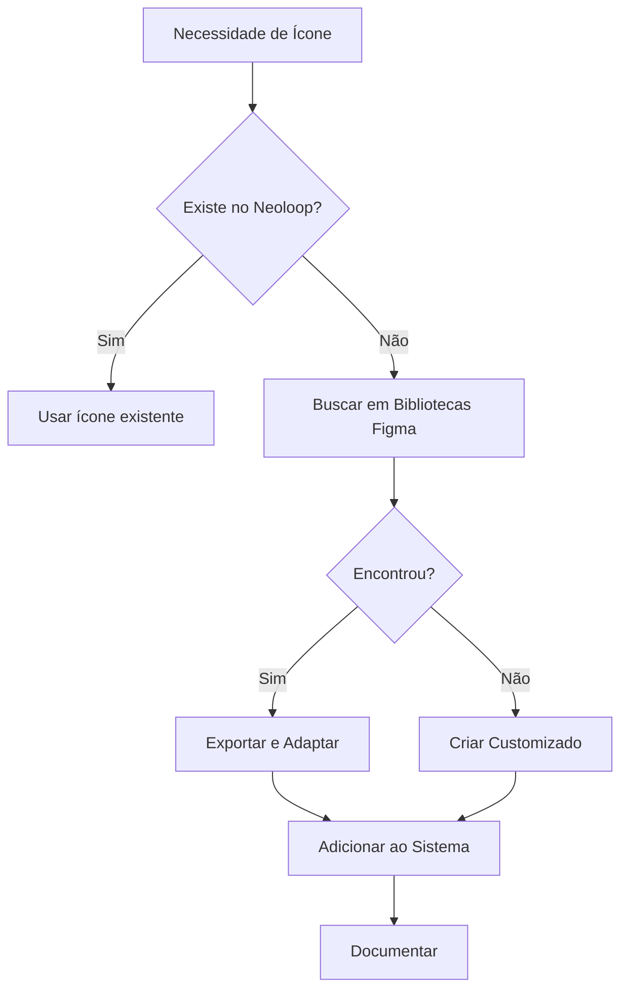

# Bibliotecas Figma - Referências de Ícones

> **Propósito:** Este documento cataloga todas as bibliotecas de ícones do Figma utilizadas como referência para o Neoloop Design System.

## 📚 Índice

- [Biblioteca 1: 10.000 Free Icons (Open Source)](#biblioteca-1-10000-free-icons-open-source)
- [Biblioteca 2: 6.000 UI Icons for Modern Interfaces](#biblioteca-2-6000-ui-icons-for-modern-interfaces)
- [Biblioteca 3: Iconly V3.0 (Free + Pro)](#biblioteca-3-iconly-v30-free--pro)
- [Como Usar Este Documento](#como-usar-este-documento)
- [Workflow de Seleção](#workflow-de-seleção)

---

## Biblioteca 1: 10.000 Free Icons (Open Source)

### 🔗 Informações Gerais

| Campo | Valor |
|-------|-------|
| **Nome** | 10.000 Free Icons - Open Source Icon Set |
| **Link Figma** | [Abrir no Figma](https://www.figma.com/design/NDeIAGM6hOfHMpsgEL2lNW/10-000-Free-Icons---Open-Source-Icon-set--Community-?node-id=1-3&m=dev&t=fou2xjj1V23k9x8O-1) |
| **Tipo** | Biblioteca Open Source |
| **Quantidade** | 10.000+ ícones |
| **Status** | ✅ Ativo |
| **Licença** | Open Source (Community) |
| **Atualizado em** | 23/01/2026 |

### 📦 Características

- **Quantidade:** 10.000+ ícones gratuitos
- **Estilo:** Múltiplos estilos (verificar no Figma)
- **Formato:** SVG (exportável)
- **Organização:** Por categorias
- **Comunidade:** Community resource (uso livre)

### 🎯 Como Usar

1. **Acessar biblioteca:**
   - Abrir link do Figma acima
   - Duplicar para sua conta (opcional)
   - Ou trabalhar diretamente no community file

2. **Buscar ícones:**
   - Usar busca do Figma para encontrar ícones específicos
   - Filtrar por categoria
   - Verificar se o estilo é compatível (outline/solid)

3. **Exportar ícones:**
   ```
   1. Selecionar ícone no Figma
   2. Clicar com botão direito > "Copy as SVG"
   3. Colar em editor de código
   4. Otimizar SVG (remover atributos desnecessários)
   5. Ajustar viewBox para "0 0 24 24"
   6. Usar currentColor para stroke/fill
   7. Salvar em assets/icons/[outline|solid]/nome-icone.svg
   ```

4. **Integrar ao Neoloop:**
   - Seguir especificações do [guia-icones.md](./guia-icones.md)
   - Aplicar padrões de nomenclatura (kebab-case)
   - Documentar no catálogo de ícones

### 📝 Ícones Mapeados

> **Lista de ícones já exportados desta biblioteca para o Neoloop:**

| Ícone | Nome Neoloop | Categoria | Estilo | Data Export | Status |
|-------|--------------|-----------|--------|-------------|--------|
| - | - | - | - | - | ⏳ Nenhum ainda |

_(Atualizar conforme ícones forem exportados)_

### 💡 Casos de Uso Recomendados

Esta biblioteca é ideal para:
- ✅ Ícones de navegação
- ✅ Ações gerais (adicionar, editar, deletar)
- ✅ Feedback visual (check, x, alerta)
- ✅ Arquivos e pastas
- ✅ Social media icons
- ✅ Ícones de interface (settings, home, user)

### ⚠️ Observações

- Verificar consistência de estilo antes de exportar
- Priorizar ícones que sigam o padrão 24x24px
- Conferir se o ícone já existe no sistema antes de adicionar
- Manter stroke-width de 2px para ícones outline

---

## Biblioteca 2: 6.000 UI Icons for Modern Interfaces

### 🔗 Informações Gerais

| Campo | Valor |
|-------|-------|
| **Nome** | 6.000+ UI Icons for Modern Interfaces |
| **Link Figma** | [Abrir no Figma](https://www.figma.com/design/m7sC70ErUZYDwVx5ZN3lBN/6000--UI-Icons-for-Modern-Interfaces--Community-?node-id=99-10432&m=dev&t=dpH0g2ur9RfORFx8-1) |
| **Tipo** | Biblioteca Community |
| **Quantidade** | 6.000+ ícones |
| **Status** | ✅ Ativo |
| **Licença** | Open Source (Community) |
| **Atualizado em** | 23/01/2026 |

### 📦 Características

- **Quantidade:** 6.000+ ícones para interfaces modernas
- **Estilo:** Focado em UI/UX moderna
- **Formato:** SVG (exportável)
- **Organização:** Por categorias de uso em interfaces
- **Comunidade:** Community resource (uso livre)
- **Otimização:** Ícones otimizados para interfaces web e mobile

### 🎯 Como Usar

1. **Acessar biblioteca:**
   - Abrir link do Figma acima
   - Duplicar para sua conta (opcional)
   - Ou trabalhar diretamente no community file

2. **Buscar ícones:**
   - Usar busca do Figma para encontrar ícones específicos
   - Filtrar por categoria de UI (botões, formulários, navegação, etc.)
   - Verificar variantes disponíveis (outline/solid/filled)

3. **Exportar ícones:**
   ```
   1. Selecionar ícone no Figma
   2. Clicar com botão direito > "Copy as SVG"
   3. Colar em editor de código
   4. Otimizar SVG (remover atributos desnecessários)
   5. Ajustar viewBox para "0 0 24 24"
   6. Usar currentColor para stroke/fill
   7. Salvar em assets/icons/[outline|solid]/nome-icone.svg
   ```

4. **Integrar ao Neoloop:**
   - Seguir especificações do [guia-icones.md](./guia-icones.md)
   - Aplicar padrões de nomenclatura (kebab-case)
   - Documentar no catálogo de ícones

### 📝 Ícones Mapeados

> **Lista de ícones já exportados desta biblioteca para o Neoloop:**

| Ícone | Nome Neoloop | Categoria | Estilo | Data Export | Status |
|-------|--------------|-----------|--------|-------------|--------|
| - | - | - | - | - | ⏳ Nenhum ainda |

_(Atualizar conforme ícones forem exportados)_

### 💡 Casos de Uso Recomendados

Esta biblioteca é ideal para:
- ✅ Componentes de UI modernos
- ✅ Ícones para formulários e inputs
- ✅ Elementos de navegação contemporâneos
- ✅ Ações e controles de interface
- ✅ Estados de interface (loading, success, error)
- ✅ Ícones para dashboards e painéis
- ✅ Elementos de e-commerce
- ✅ Comunicação e notificações

### ⚠️ Observações

- Biblioteca focada especificamente em UI moderna
- Ideal para complementar a biblioteca 1 com ícones mais específicos de interface
- Verificar se há sobreposição com ícones já existentes antes de exportar
- Priorizar ícones que sejam distintos da biblioteca 1
- Manter consistência visual com o restante do design system

---

## Biblioteca 3: Iconly V3.0 (Free + Pro)

### 🔗 Informações Gerais

| Campo | Valor |
|-------|-------|
| **Nome** | Iconly V3.0 Free + Iconly Pro |
| **Link Figma** | [Abrir no Figma](https://www.figma.com/design/0yWNm3dI8bfuO3NE9xfHch/Iconly-V3.0-Free---Iconly-Pro--Community-?node-id=0-750&m=dev&t=5epr991eqI2ghLDm-1) |
| **Tipo** | Biblioteca Community (Free + Premium) |
| **Quantidade** | 1.000+ ícones (estimativa) |
| **Status** | ✅ Ativo |
| **Licença** | Híbrida (Free + Pro) |
| **Atualizado em** | 23/01/2026 |

### 📦 Características

- **Versões:** Disponível em versão gratuita e Pro
- **Estilos múltiplos:** Cada ícone com variações de estilo
  - Linear (outline)
  - Bold
  - Bulk (dois tons)
  - Broken (traços interrompidos)
  - TwoTone
  - Light
- **Formato:** SVG (exportável)
- **Grid:** 24x24px (padrão)
- **Organização:** Por categorias temáticas
- **Qualidade:** Design profissional e consistente
- **Comunidade:** Popular na comunidade Figma

### 🎯 Como Usar

1. **Acessar biblioteca:**
   - Abrir link do Figma acima
   - Duplicar para sua conta (recomendado para versão Free)
   - Verificar quais ícones são Free vs Pro

2. **Buscar ícones:**
   - Navegar pelas categorias organizadas
   - Cada ícone tem 6 variações de estilo
   - Escolher o estilo compatível com Neoloop (Linear ou Bold)

3. **Exportar ícones:**
   ```
   1. Selecionar ícone no estilo desejado (Linear para outline, Bold para solid)
   2. Clicar com botão direito > "Copy as SVG"
   3. Colar em editor de código
   4. Otimizar SVG (remover atributos desnecessários)
   5. Ajustar viewBox para "0 0 24 24" (se necessário)
   6. Usar currentColor para stroke/fill
   7. Salvar em assets/icons/[outline|solid]/nome-icone.svg
   ```

4. **Integrar ao Neoloop:**
   - Seguir especificações do [guia-icones.md](./guia-icones.md)
   - Aplicar padrões de nomenclatura (kebab-case)
   - Documentar no catálogo de ícones
   - **Atenção:** Verificar licença se usar ícones Pro

### 📝 Ícones Mapeados

> **Lista de ícones já exportados desta biblioteca para o Neoloop:**

| Ícone | Nome Neoloop | Categoria | Estilo | Data Export | Status |
|-------|--------------|-----------|--------|-------------|--------|
| - | - | - | - | - | ⏳ Nenhum ainda |

_(Atualizar conforme ícones forem exportados)_

### 💡 Casos de Uso Recomendados

Esta biblioteca é ideal para:
- ✅ Ícones com múltiplas variações de peso/estilo
- ✅ Design system que precisa de consistência visual
- ✅ Interfaces que alternam entre outline e solid
- ✅ Projetos que valorizam design profissional
- ✅ Ícones para aplicações corporativas
- ✅ Estados diferentes (normal, hover, active) usando variações
- ✅ Quando precisa de ícones com estilo "Bulk" (dois tons)

### ⚠️ Observações

- **Licença Híbrida:** Verificar quais ícones são Free vs Pro antes de usar comercialmente
- **Múltiplos estilos:** Cada ícone tem 6 variações - escolher apenas Linear ou Bold para manter consistência
- **Qualidade premium:** Design profissional, ideal para projetos comerciais
- **Compatibilidade:** Estilo Linear é compatível com padrão Neoloop (stroke 2px)
- **Backup:** Recomendado duplicar para conta própria para garantir acesso
- **Consistência:** Priorizar usar apenas uma variante (Linear para outline, Bold para solid)

---

## Como Usar Este Documento

### Workflow de Adição de Nova Biblioteca

Quando adicionar uma nova biblioteca Figma:

1. **Adicionar ao índice** no topo do documento
2. **Criar seção** com o template abaixo
3. **Documentar características** da biblioteca
4. **Mapear ícones exportados** na tabela
5. **Atualizar data** de última modificação

### Template para Nova Biblioteca

```markdown
## Biblioteca N: [Nome da Biblioteca]

### 🔗 Informações Gerais

| Campo | Valor |
|-------|-------|
| **Nome** | Nome completo |
| **Link Figma** | [Abrir no Figma](url) |
| **Tipo** | Biblioteca/Componentes/Wireframes |
| **Quantidade** | Número de ícones/componentes |
| **Status** | ✅ Ativo / ⚠️ Em revisão / ❌ Descontinuado |
| **Licença** | Open Source / Premium / Proprietária |
| **Atualizado em** | DD/MM/YYYY |

### 📦 Características
- Lista de características principais

### 🎯 Como Usar
Instruções passo a passo

### 📝 Ícones Mapeados
Tabela com ícones exportados

### 💡 Casos de Uso Recomendados
Quando usar esta biblioteca

### ⚠️ Observações
Notas importantes
```

---

## Workflow de Seleção

### Processo Recomendado



### Critérios de Seleção

Ao escolher um ícone de uma biblioteca Figma:

1. **Consistência de Estilo**
   - [ ] Compatível com stroke-width 2px?
   - [ ] Segue o grid 24x24px?
   - [ ] Estilo visual alinhado com Neoloop?

2. **Qualidade Técnica**
   - [ ] SVG otimizado?
   - [ ] Paths limpos e simplificados?
   - [ ] Usa currentColor ou cor fixa?

3. **Usabilidade**
   - [ ] Claro em múltiplos tamanhos?
   - [ ] Reconhecível visualmente?
   - [ ] Acessível (bom contraste)?

4. **Licença**
   - [ ] Uso comercial permitido?
   - [ ] Atribuição necessária?

---

---

## Biblioteca 4: Xicons • Simple icons • Socials • Cryptocurrencies • Payments

### 🔗 Informações Gerais

| Campo | Valor |
|-------|-------|
| **Nome** | Xicons - Simple icons, Socials, Cryptocurrencies, Payments |
| **Link Figma** | [Abrir no Figma](https://www.figma.com/design/HuEMVMqbJx17aPuOJSJZVv/Xicons-%E2%80%A2-Simple-icons-%E2%80%A2-Socials-%E2%80%A2-Cryptocurrencies-%E2%80%A2-Payments--Community-?node-id=0-1&m=dev&t=8BoCMH51bHm4dN5b-1) |
| **Tipo** | Biblioteca Community |
| **Quantidade** | 1.000+ ícones (estimativa) |
| **Status** | ✅ Ativo |
| **Licença** | Open Source (Community) |
| **Atualizado em** | 24/01/2026 |

### 📦 Características

- **Ícones Simples:** Interface limpa e minimalista
- **Ícones Sociais:** Facebook, Instagram, Twitter, LinkedIn, YouTube, TikTok, WhatsApp, Discord, Reddit, Twitch, Spotify, etc.
- **Criptomoedas:** Bitcoin, Ethereum, Binance, Cardano, Solana, Polygon, etc.
- **Métodos de Pagamento:** Visa, Mastercard, PayPal, Apple Pay, Google Pay, Stripe, etc.
- **Formato:** SVG (exportável)
- **Estilo:** Minimalista, flat, consistente
- **Organização:** Por categorias (Social, Crypto, Payment, General)

### 🎯 Como Usar

1. **Acessar biblioteca:**
   - Abrir link do Figma acima
   - Duplicar para sua conta (opcional)
   - Ou trabalhar diretamente no community file

2. **Buscar ícones:**
   - Usar busca do Figma para encontrar ícones específicos
   - Filtrar por categoria (Social, Crypto, Payment)
   - Verificar variantes disponíveis (outline/filled)

3. **Exportar ícones:**
   ```
   1. Selecionar ícone no Figma
   2. Clicar com botão direito > "Copy as SVG"
   3. Colar em editor de código
   4. Otimizar SVG (remover atributos desnecessários)
   5. Ajustar viewBox para "0 0 24 24"
   6. Usar currentColor para stroke/fill
   7. Salvar em assets/icons/social/ ou assets/icons/payment/
   ```

4. **Integrar ao Neoloop:**
   - Seguir especificações do PRD (Módulo 8: Ícones Sociais)
   - Aplicar padrões de nomenclatura (kebab-case)
   - Documentar no catálogo de ícones

### 📝 Ícones Mapeados

> **Lista de ícones já exportados desta biblioteca para o Neoloop:**

| Ícone | Nome Neoloop | Categoria | Estilo | Data Export | Status |
|-------|--------------|-----------|--------|-------------|--------|
| - | - | - | - | - | ⏳ Pendente (API Rate Limit) |

_(Atualizar conforme ícones forem exportados)_

### 💡 Casos de Uso Recomendados

Esta biblioteca é ideal para:
- ✅ Ícones de redes sociais (25+ plataformas)
- ✅ Logos de criptomoedas
- ✅ Métodos de pagamento
- ✅ Ícones de marcas/empresas
- ✅ Ícones simples para interface
- ✅ Footer com links sociais
- ✅ Páginas de checkout
- ✅ Dashboards financeiros

### ⚠️ Observações

- **API Rate Limit:** Aguardar para exportar SVGs via API
- **Alternativa:** Usar Lucide React (já instalado no projeto) temporariamente
- **Logos oficiais:** Manter cores originais das marcas
- **Consistência:** Priorizar ícones com estilo similar ao design system
- **Licença:** Verificar uso comercial para logos de marcas

---

---

## Biblioteca 5: Vuesax • UIX Icons Set • 6150 free Icons

### 🔗 Informações Gerais

| Campo | Valor |
|-------|-------|
| **Nome** | Vuesax - UIX Icons Set - 6150 free Icons |
| **Link Figma** | [Abrir no Figma](https://www.figma.com/design/gBZ0BypivVAGpLmwSJ4ASI/Vuesax---UIX-Icons-Set---6150-free-Iicon---Community-?node-id=2898-35492&m=dev&t=r4O7zIKX4i1Rmrnv-1) |
| **Tipo** | Biblioteca Community |
| **Quantidade** | 6.150+ ícones |
| **Status** | ✅ Ativo |
| **Licença** | Open Source (Community) |
| **Atualizado em** | 24/01/2026 |

### 📦 Características

- **Quantidade massiva:** 6.150+ ícones gratuitos
- **Estilos múltiplos:** Bold, Broken, Bulk, Linear, Outline, **TwoTone**
- **Node IDs específicos:**
  - Linear/Outline: `node-id=2898-35492`
  - **TwoTone**: `node-id=2899-2425` ⭐
- **Categorias:** Interface, Mídia, Negócios, Desenvolvimento, E-commerce, etc.
- **Formato:** SVG (exportável)
- **Qualidade:** Alta qualidade, profissional
- **Organização:** Extremamente bem organizado por categorias

### 🎯 Como Usar

1. **Acessar biblioteca:**
   - Abrir link do Figma acima
   - Duplicar para sua conta (recomendado para acesso rápido)
   - Ou trabalhar diretamente no community file

2. **Buscar ícones:**
   - Usar busca do Figma (muito eficiente nesta biblioteca)
   - Filtrar por estilo (Bold, Outline, **TwoTone**, etc.)
   - **TwoTone:** Acesso direto via [este link](https://www.figma.com/design/gBZ0BypivVAGpLmwSJ4ASI/Vuesax---UIX-Icons-Set---6150-free-Iicon---Community-?node-id=2899-2425&m=dev&t=r4O7zIKX4i1Rmrnv-1)
   - Navegar pelas categorias organizadas

3. **Exportar ícones:**
   ```
   1. Selecionar ícone no estilo desejado
   2. Clicar com botão direito > "Copy as SVG"
   3. Colar em editor de código
   4. Otimizar SVG com SVGO
   5. Ajustar viewBox para "0 0 24 24"
   6. Usar currentColor para stroke/fill
   7. Salvar em assets/icons/[categoria]/
   ```

4. **Integrar ao Neoloop:**
   - Seguir especificações do PRD
   - Aplicar padrões de nomenclatura (kebab-case)
   - Documentar no catálogo de ícones

### 📝 Ícones Mapeados

> **Lista de ícones já exportados desta biblioteca para o Neoloop:**

| Ícone | Nome Neoloop | Categoria | Estilo | Data Export | Status |
|-------|--------------|-----------|--------|-------------|--------|
| - | - | - | - | - | ⏳ Pendente |

_(Atualizar conforme ícones forem exportados)_

### 💡 Casos de Uso Recomendados

Esta biblioteca é ideal para:
- ✅ Grande variedade de ícones de interface
- ✅ Múltiplos estilos para diferentes contextos
- ✅ **TwoTone:** Ícones com profundidade visual, perfeito para destacar
- ✅ Dashboards e painéis administrativos
- ✅ E-commerce e aplicações de negócios
- ✅ Aplicações mobile (styles Bulk e Broken são ótimos)
- ✅ Quando precisa de MUITAS opções de ícones
- ✅ Design systems que precisam de variações do mesmo ícone

### ⚠️ Observações

- **Biblioteca massiva:** Pode demorar para carregar no Figma
- **Melhor duplicar:** Para performance, duplique para sua conta
- **Consistência de estilo:** Escolher um estilo e manter (Linear ou Bold)
- **Otimização:** SVGs precisam de otimização (SVGO) antes de usar
- **Alternativa ao Heroicons/Feather:** Excelente alternativa com mais variedade

---

## 📊 Estatísticas

| Métrica | Valor |
|---------|-------|
| **Total de Bibliotecas** | 5 |
| **Total de Ícones Disponíveis** | 24.000+ |
| **Ícones Exportados** | 33 (10K Free Icons) |
| **Ícones Sociais (constantes)** | 30 (social + payment + brand) |
| **Última Atualização** | 24/01/2026 |

---

## 🔗 Links Relacionados

- [Guia de Ícones](../../docs/02-DESIGN/icons/guia-icones.md) - Especificações técnicas e uso
- [Design Tokens](../../docs/02-DESIGN/design-tokens/) - Tokens de cor e espaçamento
- [Neoloop Assets](./) - Pasta de ícones do sistema

---

_Para adicionar mais bibliotecas, siga o template documentado na seção "Como Usar Este Documento"._
