# Neoloop Design System - Component Architecture Diagram
**Visual Architecture Overview**
**Data:** 2026-01-30

---

## 🏗️ ARQUITETURA DE COMPONENTES

### Layer Architecture (Top-Down)

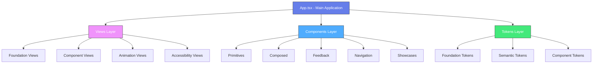

---

## 🎨 FOUNDATION TOKENS LAYER

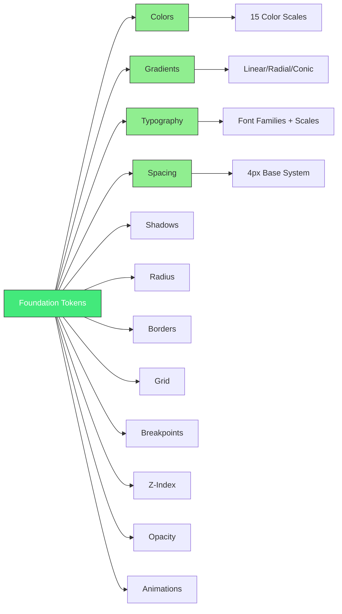

---

## 🧩 COMPONENT HIERARCHY

### Primitives (Atomic Components)

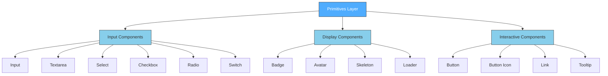

### Composed Components

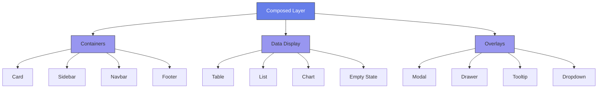

---

## 🔄 DATA FLOW ARCHITECTURE

### Token → Component → View Flow

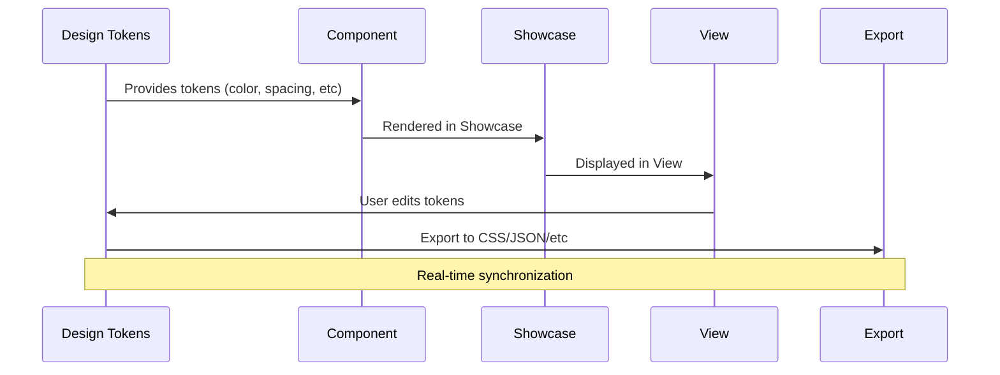

---

## 📦 MODULE DEPENDENCY GRAPH

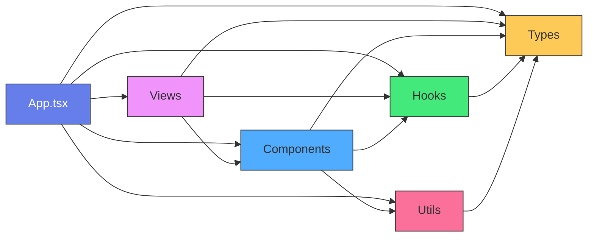

**Legend:**
- **Purple (App):** Entry point
- **Pink (Views):** Editor screens
- **Blue (Components):** UI components
- **Green (Hooks):** Custom React hooks
- **Red (Utils):** Utilities and helpers
- **Yellow (Types):** TypeScript definitions

---

## 🎯 COMPONENT COMPOSITION PATTERN

### Example: Card Component

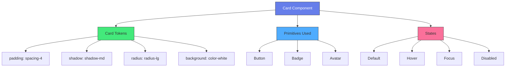

---

## 🔧 BUILD & EXPORT PIPELINE

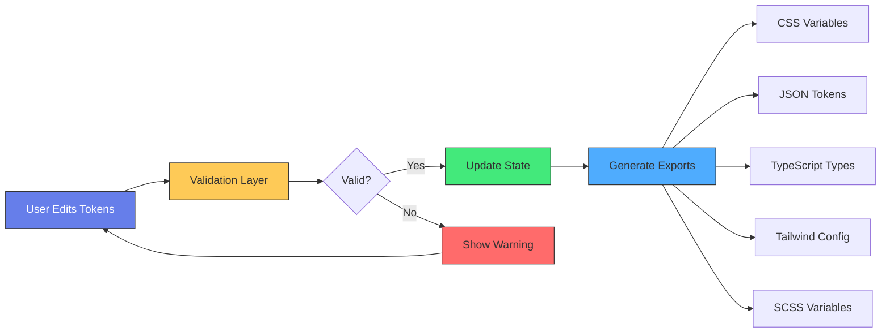

---

## ♿ ACCESSIBILITY VALIDATION FLOW

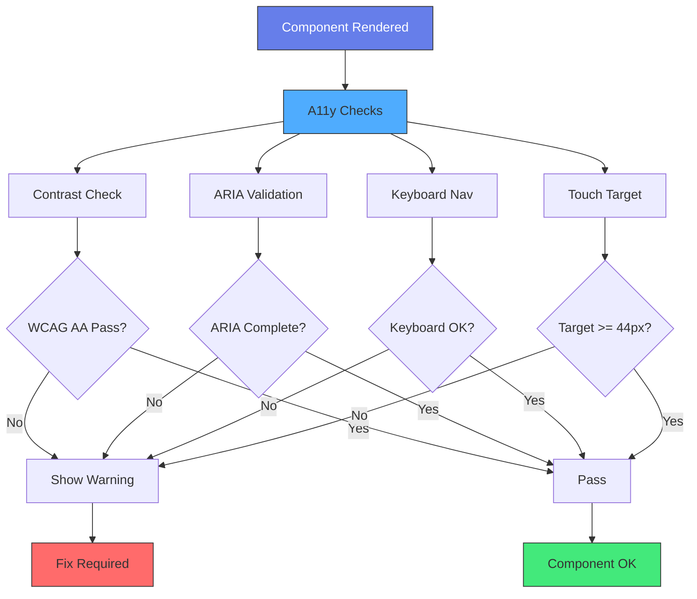

---

## 🚀 DEPLOYMENT ARCHITECTURE (Future v1.1)

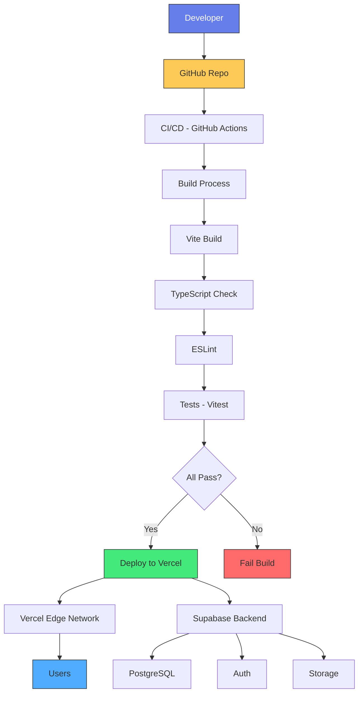

---

## 📊 STATE MANAGEMENT ARCHITECTURE

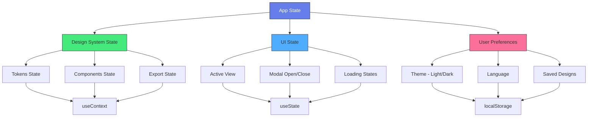

---

## 🔍 COMPONENT FILE STRUCTURE

### Standard Component Structure

```
Component/
├── Component.tsx              # Main implementation
├── Component.types.ts         # TypeScript interfaces
├── Component.styles.ts        # Tailwind classes (or CSS)
├── Component.test.tsx         # Unit tests
├── Component.stories.tsx      # Storybook stories (future)
├── index.ts                   # Barrel export
└── README.md                  # Component documentation
```

### Example: Button Component

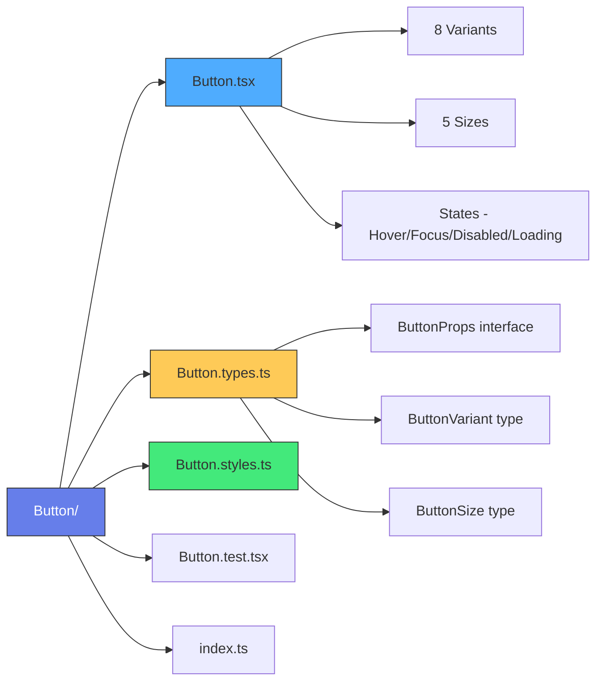

---

## 🌐 EXPORT FORMATS ARCHITECTURE

```mermaid
graph TD
    A[Design System Tokens] --> B[Export Engine]

    B --> C[CSS Variables Export]
    B --> D[JSON Export]
    B --> E[TypeScript Export]
    B --> F[Tailwind Config Export]
    B --> G[SCSS Export]
    B --> H[Figma Tokens Export]

    C --> C1[:root { --color-primary: #667eea; }]
    D --> D1[{ color: { primary: '#667eea' } }]
    E --> E1[export const tokens = { color: { primary: '#667eea' } }]
    F --> F1[theme: { extend: { colors: { primary: '#667eea' } } }]
    G --> G1[$color-primary: #667eea;]
    H --> H1[Figma JSON format]

    style A fill:#667eea,stroke:#333,color:#fff
    style B fill:#4facfe,stroke:#333
    style C fill:#43e97b,stroke:#333
    style D fill:#43e97b,stroke:#333
    style E fill:#43e97b,stroke:#333
    style F fill:#43e97b,stroke:#333
    style G fill:#43e97b,stroke:#333
    style H fill:#43e97b,stroke:#333
```

---

## 🧪 TESTING ARCHITECTURE

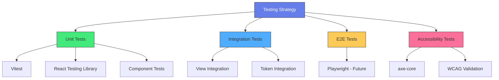

---

## 📱 RESPONSIVE ARCHITECTURE

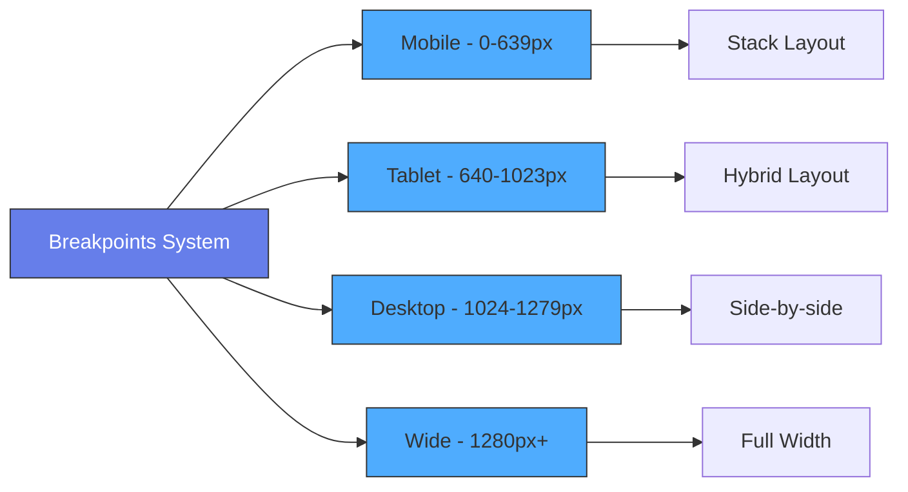

---

## 🎨 THEMING ARCHITECTURE

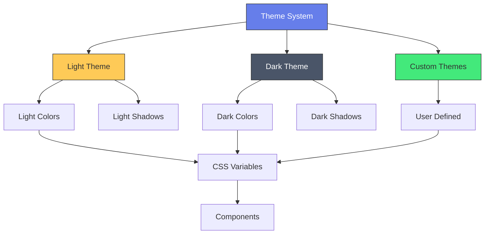

---

## 🔐 SECURITY & VALIDATION LAYER

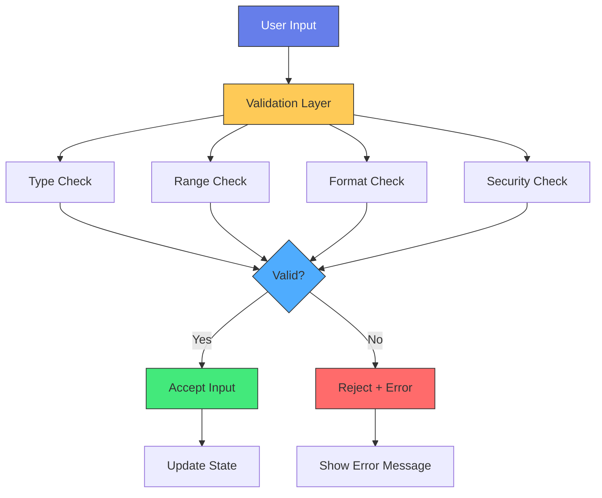

---

## 📚 SUMMARY: ARCHITECTURAL PRINCIPLES

### 1. **Token-Driven Design**
All visual properties derive from design tokens.

### 2. **Component Composition**
Build complex components from atomic primitives.

### 3. **Accessibility First**
Every component validates against WCAG standards.

### 4. **Type Safety**
Full TypeScript coverage with strict mode.

### 5. **Export Flexibility**
Support multiple output formats for ecosystem compatibility.

### 6. **Performance Optimized**
Lazy loading, code splitting, memoization.

### 7. **Testable Architecture**
100% unit test coverage target, integration tests.

### 8. **Documentation as Code**
Showcases serve as live documentation.

---

**Documento Criado:** 2026-01-30
**Por:** Backend System Architect
**Caminho:** `/docs/03-ARCHITECTURE/component-architecture-diagram.md`
